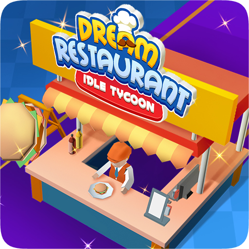

<head>
  <link rel="stylesheet" type="text/css" href="Style/style.css">
</head>

  

<h2 align="center">Hi 🎮! I'm Balduu</h2>

###

<h3 align="left">😺  About Me</h3>

###

My name is Bao Duc, a game developer based in Hanoi, Vietnam, with experience in creating idle games using Unity. I enjoy designing and optimizing BOT behavior models and am currently exploring ECS for scalable character actions. I'm also passionate about advanced AI techniques like ML-Agents and GOAP, striving to bring innovation to game development. 

###
**`Game Developer`** **`Backend Developer`**
###

### 🧰 Languages and Tools

    

          

  

  

### 🏆 Achievement

  <h4 style="padding-left:10px;">✨ 3rd prize from Abi Game Jam 2023 - Revolution of Puzzle</h4>
  
Fire Rescue: Puzzle Brigade

### 🕹️ Participated projects

  
  

        <h4 style="padding-left:115px;">Dream Restaurant - Idle Tycoon </h4>
        
4.6 ⭐ 

        
        
    

  
  

        <h4 style="padding-left:115px;" class="game-info">Hotdog Bitte: Idle Tycoon </h4>
        
3.9 ⭐ 

        
        
    

